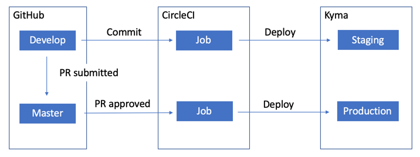
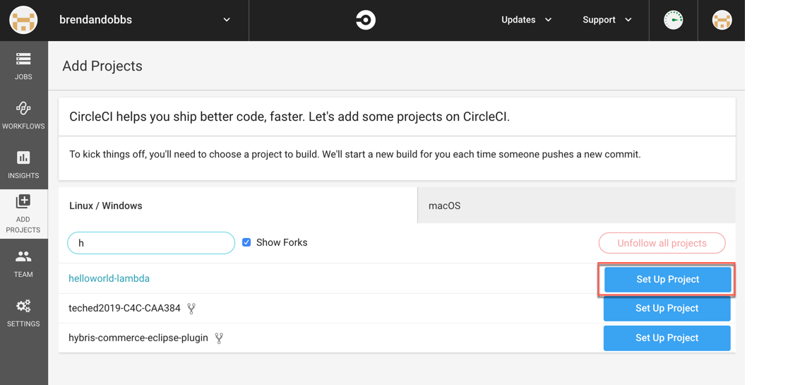
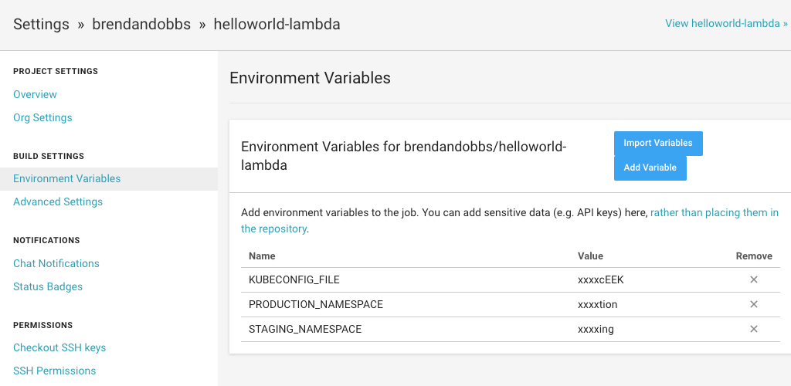

# Simple CI/CD example for Kyma Functions

This is a simple example of how to setup a CI/CD workflow to automate the deployment of Functions to Kyma. We are using CircleCI for this example but it should be easy to configure another tool by reusing the build script (gulpfile.js) and taking what you need from the CircleCI configuration [(.circleci/config.yml)](./.circleci/config.yml)

## Local Development

For local development you can use a Code Editor/IDE installed locally to make changes to your code and automate the deployment to the Kyma cluster. Developing locally has the advantage that we can use preferred development tools however the code changes still need to be deployed to a cluster for testing. 

### Prerequisites
* [kubectl](https://kubernetes.io/docs/tasks/tools/install-kubectl/) (check the version for your Kyma cluster)
* [kubeconfig file](https://kyma-project.io/docs/components/security/#details-iam-kubeconfig-service-get-the-kubeconfig-file-and-configure-the-cli) 
* Node.js (>=8)

### Steps
1. Install the gulp build system for Node.js
```
npm install --global gulp-cli 
```
2. Follow the instructions [here] to setup kubectl to access your cluster. The generated kubeconfig file will expire after 8 hours so you might prefer to use an alternative method of connecting to your cluster (e.g. gcloud or azure CLI, Service Account file)
3. Set the namespace where you will be deploying your changes
```
kubectl config set-context --current --namespace=<namespace>
```  
4. Start watching for changes (auto deploy)
```
gulp watch
```
Every change to a *.js or *.json will trigger a deployment. If you prefer to deploy more selectively, execute the following command instead
```
gulp deploy
``` 
### Environment Variables
Create a file called envvars.json to specfic the environment variables that will be used by your function.
Example:
```
{
    "envVariable1" : "value1",
    "envVariable2" : "value2"
}
```
### Helper Tasks

To make it easier to develop locally there are some helper tasks that make it easy to execute kubectl commands

#### Function Status

To see the deployment status of the Function (Pod) execute the following command
```
gulp status
```

#### Function Logs

To see the logs of the Function (Pod), execute the following command (defaults to the last hour of logs)
```
gulp logs
```

### Tips
* This gulp build script requires that the package.json file has a value set for the name attribute. The name is used for the name of the Function that will be deployed. 
* Other kubernetes resources (yaml files) can be deployed by adding them to the k8s directory

## Deploying with CircleCI

The CircleCI config file can be found in [.circleci/config.yml)](./.circleci/config.yml). It is designed to be easily reused (as is gulfile) for deloying different functions. The CircleCI config.yml file is mostly delegating to the gulp build file [gulpfile.js](./gulpfile.js) so it should be easy enough to use this file as an example of how to deploy a Function using another CI/CD tool.

A simple workflow is configured based on 2 branches: 
* master (production)
* develop (test/staging)

Both master and develop deploy to the same cluster (shared kubeconfig file) however it would be a simple change to support multiple clusters.

* Developers have changes to test in the testing environment they submit a PR (or commit directly) to the develop branch 
* Once the PR is approved (or commit is made), the CircleCI job generates the Function yaml file and deploys the Function and other resources to the staging namespace
* After testing, a PR is created from develop to the master branch
* Once the PR is approved, the CircleCI job deployes the Function and other resources to the production namespace



### Steps
1. Enable your Github repo with your as a project in CircleCI



2. Base64 encode your kubeconfig file (use base64 command on linux/Macos or https://www.base64encode.org/)
```
base64 <kubeconfig_file>
```
3. Create a new environment variable in the CirceCI job called 'KUBECONFIG_FILE', with the base64 encoded kubeconfig value
4. Create a new environment variable called 'PRODUCTION_NAMESPACE' using the target production namespace as a value
5. Create a new environment variable called 'STAGING_NAMESPACE' using the target testing namespace as a value



### Tips
* The mapping of branch names to namespaces can be configured in the CircleCI [config.yml)](./.circleci/config.yml)
* Only the develop and master branches are configured to trigger the job. Edit the workflow in [config.yml)](./.circleci/config.yml) to add additional branches to the filter

### Further improvements
* Run tests
* Test if deployment was successful


